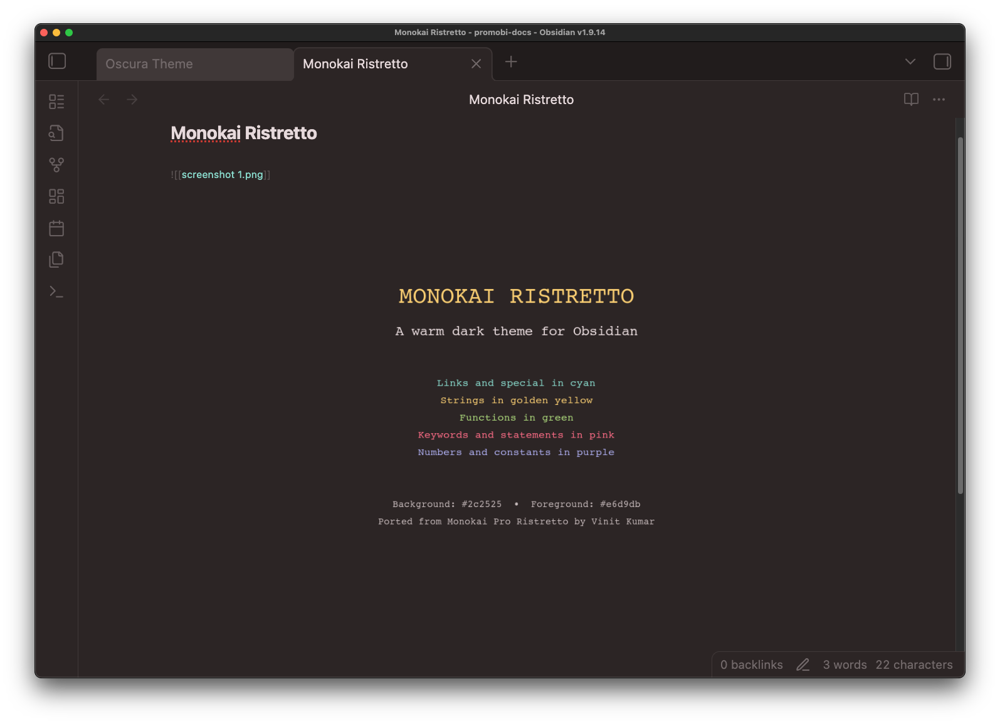

# Monokai Ristretto Theme for Obsidian

A warm, dark theme for Obsidian, ported from the [Monokai Pro Ristretto](https://github.com/vinitkumar/monokai-pro-vim) vim colorscheme.

## Features

- **Warm Dark Mode**: Rich, coffee-inspired color palette with warm tones
- **Syntax Highlighting**: Vibrant colors optimized for code blocks and inline code
- **Clean UI**: Minimal, distraction-free interface
- **Consistent Colors**: Based on the beloved Monokai Pro color scheme

## Color Palette

- Background: `#2c2525`
- Foreground: `#e6d9db`
- Comments: `#72696a`
- Keywords: `#fd6883`
- Functions: `#adda78`
- Strings: `#f9cc6c`
- Numbers: `#a8a9eb`
- Links: `#85dacc`
- Tags: `#fd6883`

## Installation

### From Obsidian

1. Open Obsidian Settings
2. Go to Appearance → Themes → Manage
3. Search for "Monokai Ristretto"
4. Click Install and use

### Manual Installation

1. Download this repository
2. Copy the `theme.css` file to your vault's `.obsidian/themes/` folder
3. Open Obsidian Settings → Appearance
4. Select "Monokai Ristretto" from the theme dropdown

## Screenshots

## Credits

Ported from [Monokai Pro Ristretto vim theme](https://github.com/vinitkumar/monokai-pro-vim) by Vinit Kumar.

Original Monokai Pro by [gthelding](https://github.com/gthelding/monokai-pro.nvim).

## License

MIT License - See LICENSE file for details
